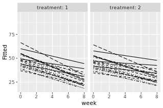

# **Assignment 6: Analysis of longitudinal data**

This week the aim was to study two different datasets with repeated
measurements on each subject. Repeated measurements pose problems for
the analysis as they are usually correlated rather than independent.

**PART I: Rats**

First dataset to analyze consists of observations 16 rats and their body
weight evolution. The rats were divided into three groups that received
different diets. The body weight was measured weekly over 9 weeks. The
weekly observations are first gathered into long form. A plot showing
the weight development of each individual rat is shown below.

```{r}
library(tidyr); library(dplyr)
library(ggplot2); library(GGally)

# Read the RATS data
RATS <- read.table("https://raw.githubusercontent.com/KimmoVehkalahti/MABS/master/Examples/data/rats.txt",  header = TRUE, sep = '\t')

glimpse(RATS)

# Factor variables ID and Group
RATS$ID <- factor(RATS$ID)
RATS$Group <- factor(RATS$Group)

# Convert data to long form and extract Time variable as integer
RATSL <- RATS %>%
  gather(key = WD, value = Weight, -ID, -Group) %>%
  mutate(Time = as.integer(substr(WD,3,4))) 

ggplot(RATSL, aes(x = Time, y = Weight, group = ID)) +
  geom_line(aes(linetype = Group)) + 
  scale_x_continuous(name = "Time (days)", breaks = seq(0, 60, 10)) + 
  scale_y_continuous(name = "Weight (grams)") + theme(legend.position = "top")
```

In order to see how the diet influences the weights, it could be useful
to standardize the weights first. This removes the effect of the
heaviest rats being the heaviest throughout the experiment and gives the
same baseline for all individuals in the beginning.

```{r}
# Standardise the variable Weight
RATSL <- RATSL %>%
  group_by(Time) %>%
  mutate(stdweight = (Weight - mean(Weight))/sd(Weight) ) %>%
  ungroup()

# Plot again with the standardized Weight
ggplot(RATSL, aes(x = Time, y = stdweight, group = ID)) +
  geom_line(aes(linetype = Group)) + 
  scale_x_continuous(name = "Time (days)", breaks = seq(0, 60, 10)) + 
  scale_y_continuous(name = "Standardized Weight (grams)") + theme(legend.position = "top")
```

The lines representing the weight development of individual rats in the
figure above suggest that there may be some differences between the
groups. To study this better, a mean of each group is taken and plotted
below. (Here I got a bit lost as I was not sure if n was supposed to
represent the amount of time steps / measurements like in the DataCamp
exercise or number of individuals in a group like in the correction of
the exercise. I chose the first option simply because the group sizes
were not even: Group 1 has 8 individuals while groups 2 and 3 have four
in each.)

```{r}
# Number of weeks, baseline (week 0) included
n <- 11

# Summary data with mean and standard error of Weight by Group and week 
RATSS <- RATSL %>%
  group_by(Group, Time) %>%
  summarise( mean = mean(Weight), se = sd(Weight)/sqrt(n) ) %>%
  ungroup()

# Plot the mean profiles
ggplot(RATSS, aes(x = Time, y = mean, linetype = Group, shape = Group)) +
  geom_line() + scale_linetype_manual(values = c(1,2,3)) +
  geom_point(size=3) +
  scale_shape_manual(values = c(1,2,3)) +
  geom_errorbar(aes(ymin = mean - se, ymax = mean + se, linetype="1"), width=0.3) +
  theme(legend.position = c(0.8,0.5)) +
  scale_y_continuous(name = "mean(Weight) +/- se(Weight)")

```

From the means above it can be seen that Group has higher standard error
than the other two groups. It might be worthwhile to check what is going
on there. The distributions are analyzed with boxplots in the figure
below.

```{r}
# Create a summary data by Group and ID with mean as the summary variable (ignoring baseline week 0).
RATSL8S <- RATSL %>%
  filter(Time > 0) %>%
  group_by(Group, ID) %>%
  summarise( mean=mean(Weight) ) %>%
  ungroup()

# Draw a boxplot of the mean versus treatment
ggplot(RATSL8S, aes(x = Group, y = mean)) +
  geom_boxplot() +
  stat_summary(fun = "mean", geom = "point", shape=23, size=4, fill = "white") +
  scale_y_continuous(name = "mean(weight), weeks 1-8")

```

The boxplots reveal that all the groups have outliers, but in Group the
outlier is causing quite strong skewedness. Therefore it should be
removed and filtered out.

```{r}
# Create a new data by filtering the outlier and adjust the ggplot code the draw the plot again with the new data
RATSL8S1 <- RATSL8S %>%
  filter(mean < 550)

ggplot(RATSL8S1, aes(x = Group, y = mean)) +
  geom_boxplot() +
  stat_summary(fun = "mean", geom = "point", shape=23, size=4, fill = "white") +
  scale_y_continuous(name = "mean(weight), weeks 1-8")
```

New boxplots without the outlier (above) seem better. Group 3 is still a
bit skewed, but I can live with this and continue to perform t-test. As
t-tests are used to define if the significance between two samples are
significantly different and here three groups are studied, I compared
groups 1 and 2, groups 1 and 3 and groups 2 and 3 together. As seen from
the results below, the p-values are low for all comparisons and
therefore it seems that the diets really influence the weight
development.

```{r}
# Perform t-test on groups 1 & 2
t.test(mean[1:11] ~ Group[1:11], data = RATSL8S1, var.equal = TRUE)
# Perform t-test on groups 1 & 3
t.test(mean[c(1:8,12:15)] ~ Group[c(1:8,12:15)], data = RATSL8S1, var.equal = TRUE)
# Perform t-test on groups 2 & 3
t.test(mean[9:15] ~ Group[9:15], data = RATSL8S1, var.equal = TRUE)
```

I also use the baseline as a separate variable to see how it relates to
the different diets between different groups. From the results shown
below, it is seen that the baseline correlates significantly with the
individuals response to the diet. However, differences between the
groups are not significant (Pr(>F) \> 0.05).

```{r}
# Add the baseline from the original data as a new variable to the summary data
RATSL8S2 <- RATSL8S %>%
  mutate(baseline = RATS$WD1)

# Fit the linear model with the mean as the response 
fit <- lm(mean ~ baseline + Group, data = RATSL8S2)

# Compute the analysis of variance table for the fitted model with anova()
anova(fit)
```

**PART II: Psychiatric patients**

The second dataset consists of observations of 40 individuals suspected
of having schizophrenia. The individuals are randomly divided into two
groups receiving different treatments. The effect of the treatment is
measured with brief psychiatric rating scale (bprs) and the individuals
are followed for eight weeks.

This dataset is as well transformed to the long form before analysis.
The summary of the data is given in the plot below, which shows the
influence of the treatment of each individual with group 1 on the left
and group 2 on the right panel.

```{r}
BPRS <- read.table("https://raw.githubusercontent.com/KimmoVehkalahti/MABS/master/Examples/data/BPRS.txt", sep  =" ", header = T)

# Factor treatment & subject
BPRS$treatment <- factor(BPRS$treatment)
BPRS$subject <- factor(BPRS$subject)

# Convert to long form
BPRSL <- BPRS %>% gather(key = weeks, value = bprs, -treatment, -subject)

# Extract the week number
BPRSL <-  BPRSL %>% mutate(week = as.integer(substr(weeks,5,5)))

# Take a glimpse at the BPRSL data
glimpse(BPRSL)

# Draw the plot
ggplot(BPRSL, aes(x = week, y = bprs, linetype = subject)) +
  geom_line() +
  scale_linetype_manual(values = rep(1:10, times=4)) +
  facet_grid(. ~ treatment, labeller = label_both) +
  theme(legend.position = "none") + 
  scale_y_continuous(limits = c(min(BPRSL$bprs), max(BPRSL$bprs)))
```

As a first step, the correlation of the repeated measurements is ignored
and a simple linear regression model is fitted to the data with BPRS as
target variable and week and treatment as explanatory variables.

```{r}
# create a regression model BPRS_reg
BPRS_reg <- lm(bprs ~ week + treatment, data = BPRSL)

# print out a summary of the model
summary(BPRS_reg)
```

Because the assumption of independence is most likely misleading, it is
better to fit a random intercept model to the data. Week and treatment
are the explanatory variables and subject the random effect, which
accounts for unmeasured individual qualities that can influence the
results.

Unfortunately there were again some dependencies not working in my
version of R (on Ubuntu) and to be able to use lme4 library I would have
had to downgrade R to an older version. I was too short on time to go
through that trouble, so I just tried to run the pieces of code on DataCamp and
copy-paste the results from there. R-markdown managed to mess up the formatting of the copy-pasted summaries, so I was not able to do any sensible analysis out of them after all, so this analysis consists of the steps taken in order to perform the analysis.

```{r echo=TRUE}
# access library lme4
#library(lme4)

# Create a random intercept model
#BPRS_ref <- lmer(bprs ~ week + treatment + (1 | subject), data = BPRSL, REML = FALSE)

# Print the summary of the model
#summary(BPRS_ref)
```

```{r}
#Linear mixed model fit by maximum likelihood \['lmerMod'\] Formula: bprs
#\~ week + treatment + (1 \| subject) Data: BPRSL

#     AIC      BIC   logLik deviance df.resid 

#2748.7 2768.1 -1369.4 2738.7 355

#Scaled residuals: Min 1Q Median 3Q Max -3.0481 -0.6749 -0.1361 0.4813
#3.4855

#Random effects: Groups Name Variance Std.Dev. subject (Intercept) 47.41
#6.885\
#Residual 104.21 10.208\
#Number of obs: 360, groups: subject, 20

#Fixed effects: Estimate Std. Error t value (Intercept) 46.4539 1.9090
#24.334 week -2.2704 0.2084 -10.896 treatment2 0.5722 1.0761 0.532

#Correlation of Fixed Effects: (Intr) week\
#week -0.437\
#treatment2 -0.282 0.000
```


The random intercept model does not take into account the effect of
time, which mean it constrains the variance of each repeated measurement
to be the same and the correlation of each pair of measurements to be
equal. This is an unlikely situation and therefore, in order to include
also the effect of time on the results, I add random slope to the random
intercept model.

```{r echo=TRUE}
# create a random intercept and random slope model
#BPRS_ref1 <- lmer(bprs ~ week + treatment + (week | subject), data = BPRSL, REML = FALSE)

# print a summary of the model
#summary(BPRS_ref1)
```


Next the analysis of variance is performed to compare the two tests.
 

```{r echo=TRUE}
# perform an ANOVA test on the two models
#anova(BPRS_ref1, BPRS_ref)

#Data: BPRSL Models: BPRS_ref: bprs \~ week + treatment + (1 \| subject)
#BPRS_ref1: bprs \~ week + treatment + (week \| subject) Df AIC BIC
#logLik deviance Chisq Chi Df Pr(>Chisq)\
#BPRS_ref 5 2748.7 2768.1 -1369.4 2738.7\
#BPRS_ref1 7 2745.4 2772.6 -1365.7 2731.4 7.2721 2 0.02636 *--- 
#Signif.codes: 0 '***' 0.001 '**' 0.01 '\*' 0.05 '.' 0.1 ' ' 1
```

Next a random intercept and random slope model with the interaction week x treatment is created. Then the model is tested against the random intercept and random slope model without this interaction. 

```{r echo=TRUE}
# create a random intercept and random slope model with the interaction
#BPRS_ref2 <- lmer(bprs ~ week * treatment + (week | subject), data = BPRSL, REML = FALSE)

# print a summary of the model
#summary(BPRS_ref2)
```

```{r echo=TRUE}
# perform an ANOVA test on the two models
#anova(BPRS_ref2, BPRS_ref1)

#Data: BPRSL Models: BPRS_ref1: bprs \~ week + treatment + (week \|
#subject) BPRS_ref2: bprs \~ week \* treatment + (week \| subject) Df AIC
#BIC logLik deviance Chisq Chi Df Pr(>Chisq)\
#BPRS_ref1 7 2745.4 2772.6 -1365.7 2731.4\
#BPRS_ref2 8 2744.3 2775.4 -1364.1 2728.3 3.1712 1 0.07495 . --- 
#Signif.codes: 0 '***' 0.001 '**' 0.01 '*' 0.05 '.' 0.1 ' ' 1
```


```{r echo=TRUE}
# Plot the fitted data
#ggplot(BPRSL, aes(x = week, y = Fitted, linetype = subject)) +
#  geom_line(aes(linetype = subject)) +
 # scale_linetype_manual(values = rep(1:10, times=4)) +
 # facet_grid(. ~ treatment, labeller = label_both) +
 # theme(legend.position = "None") + 
 # scale_y_continuous(limits = c(min(BPRSL$bprs), max(BPRSL$bprs)))
```


